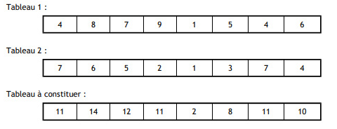

## Exercices

Faites une fonction par exercices...

/!\.PENSEZ.AU.CONSOLE.LOG.C.EST.VOTRE.MEILLEUR.AMI./!\

### 1. Algorithme de prédiction d'avenir

Il demande à l'utilisateur de donner une heure et des minutes (séparemment)

Si l'utilisateur saisie :

- Heure : 11
- Minutes : 13
  L'algo doit écrire : "Dans 1 minute il sera 11h14"

(Bonus : pour ceux qui trouve comment afficher réellement qu'il est 11h14, 1 min après !)

### 2. Le magasin de reprographie

```
- Nom de la fonction : "calculPriceBy"
- Paramètres :
  - "copy", un entier
```

- Par défaut le prix est de 0.11€

- De 10 à 49 copies, alors le prix unitaire est de 0.10€
- De 50 à 99 copies, alors le prix unitaire est de 0.09€
- Au delà de 100 copies, alors le prix unitaire est de 0.08€

### 3. Le calcul d'âge

```
- Nom de la fonction : "getAge"
- Paramètres :
  - "year", un entier
```

La fonction doit renvoyer l'age de l'utilisateur à partie de l'année de naissance passée en paramètre

### 4. On compte !

```
- Nom de la fonction : "countUpToTen"
- Paramètres :
  - "startFrom", un entier
```

La fonction doit compter depuis le nombre "startFrom" + 10, et afficher les différents chiffres.
Par exemple, si je lui passe "17", la fonction doit afficher les nombres de "18 à 27".

### 5. La table de multiplication

```
- Nom de la fonction : "displayMultiply"
- Paramètres :
  - "digit", un entier
```

La fonction doit afficher la table de multiplication du paramètre "digit", jusqu'à 12.

Par exemple pour digit = 3 :

```
1 x 3 = 3
2 x 3 = 6
3 x 3 = 9
...
12 x 3 = 36
```

### 6. Calcul somme

```
- Nom de la fonction : "addUpTo"
- Paramètres :
  - "max", un entier
```

La fonction doit addition tous les chiffres jusqu'à "max", le paramètre et afficher le résultat.
Exemple pour max = 5

```
1 + 2 + 3 + 4 + 5 = 15
La fonction affiche donc "15"
```

### 7. Les voyelles

```
- Nom de la fonction : "displayVowels"
- Paramètres :
  - Aucun
```

La fonction doit créer un tableau des voyelles de notre alphabet, et l'afficher.

### 8. Calcul de la moyenne

```
- Nom de la fonction : "getAverage"
- Paramètres :
  - "grades", un tableau de nombre (entier ou à virgules)
```

Reprennez cet algorithme pour l'adapter en Javascript :

```
FONCTION moyenne(grades)
DEBUT
    sum <- 0
    tailleArray <- LONGUEUR(grades)
    POUR i <- 0 JUSQU'A i < tailleArray FAIRE
       sum <- sum + grades[i]
       i <- i + 1
    FINPOUR
    RETOUR sum / tailleArray
FIN

moyenne([10, 15, 15, 12, 18]) #14
moyenne([14, 16, 17, 13, 10]) #14
moyenne([14, 16, 17, 13, 18, 2, 14]) #14
```

### 9. Ajout de tableau

```
- Nom de la fonction : "addArray"
- Paramètres :
  - "first", un tableau d'entier
  - "second", un tableau d'entier
```

Les deux tableaux doivent être de longueur égales, si ce n'est pas le cas, la fonction ne fait rien.
Si les tableaux sont de longueur identique, alors on les parcours et on ajoute leur index respectifs, dans un nouveau tableau en sortie.

On affiche le nouveau tableau, exemple


### 10. Les doublons

```
- Nom de la fonction : "removeDuplicate"
- Paramètres :
  - "array", un tableau d'entier ou de string, ou de char
```

La fonction doit créer un nouveau tableau, n'ayant plus les éléments en doublons du tableau initial.

Par exemple :

```
[1, 1, 1, 2, 5, 8, 7, 5]
La fonction affiche donc [1, 2, 5, 8, 7]
```

### 11. Inversement de mot

```
- Nom de la fonction : "inverseWord"
- Paramètres :
  - "str", une chaine de caractères
```

La fonction doit afficher la chaine de caractères inverses de celle passée en paramètres.
Exemple avec : "espion" :

```
La fonction affiche "noipse"
```

```

```
